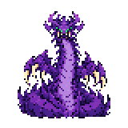
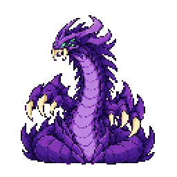

# 바론 보스 스프라이트: 이 파일을 사용하세요

같은 PR에 [용준·쥰희의 나무 대포](wooden-cannon-sprite.md)도 포함되어 있습니다. 대포와 바론의 구체적인 게임 상호작용은 구현 세션에서 결정합니다.

LoL 바론을 모티브로 제작한 보스입니다. 사용자의 최신 지시 **“더 크고 웅장하게”**를 반영해, 작은 초기 초안 대신 긴 목·거대한 발톱·넓은 꼬리 코일의 `v2-grand`만 전달합니다.

이 PR은 이미지와 사용 안내만 추가합니다. 보스 등록, 맵 배치, 능력치, 공격 패턴, 전투 연결은 게임 구현 세션에서 진행해 주세요. 연결 완료나 자동 적용을 의미하지 않습니다.

## 파일

기본 경로: `assets/source/baron-v2-grand/`

| 용도 | 파일 | 규격 |
| --- | --- | --- |
| 필드 정면 | `front/front-1.png` | 투명 RGBA 160×160, 1장 |
| 왼쪽 전투 대기 시트 | `battle-idle/sheet-transparent.png` | 투명 RGBA 512×512, 2열×2행, 셀256×256 |
| 전투 개별 프레임 | `battle-idle/idle-1.png` ~ `idle-4.png` | 각각256×256 |
| 동작 미리보기 | `battle-idle/animation.gif` | 4프레임, 각240ms, 960ms 반복 |
| 생성 지시 기록 | 각 폴더의 `prompt.txt` | 내장 이미지 생성 프롬프트 |

전투 시트는 좌상 → 우상 → 좌하 → 우하 순서입니다. 적은 오른쪽에 서서 왼쪽을 바라보며 반전하지 않습니다. 목의 호흡·턱·발톱 변화가 있는 대기 모션이며, 공격/피격/이동으로 사용하지 마세요.

## 큰 보스 크기를 유지하세요

- 일반 적군용 64×64 셀로 축소하거나 자동 크기 정규화를 적용하지 마세요. 전투는 256×256 셀 자체가 의도한 보스 규격입니다.
- 1배 표시 기준 실제 전투 실루엣은 대략194×208~216px입니다. 기존 약44~54px 높이 일반 몹보다 약4배 높게 보이도록 만든 자산입니다. 전투 화면 높이가360인 경우 이 보스 크기를 우선 유지하고 위치/UI 여백을 조정하세요.
- 전투 바닥 앵커는 셀 내부 `(128,238)`, 필드 바닥 앵커는 `(80,148)`입니다. 좌표는 경계 기준이며 실제 불투명 마지막 픽셀은 각각 y=237,147입니다.
- 프레임마다 따로 꽉 채워 리사이즈하지 말고 공통 셀·공통 앵커를 유지하세요. 충돌 영역을 이미지 셀 전체와 동일하게 만들 필요는 없습니다.
- 출력은 논리 도트80/128px에서 최근접2배 확대한 것이므로 스무딩을 끄세요. 불가피한 배율 조절 시에도 도트와 보스 크기를 유지하세요.

생성 원본과 논리 해상도 추출물은 이미지 스튜디오의 `output/sprites/baron-v2-grand/`에 보존했습니다. 작은 `baron-v1` 초안은 이 PR에 포함하지 않았습니다.
