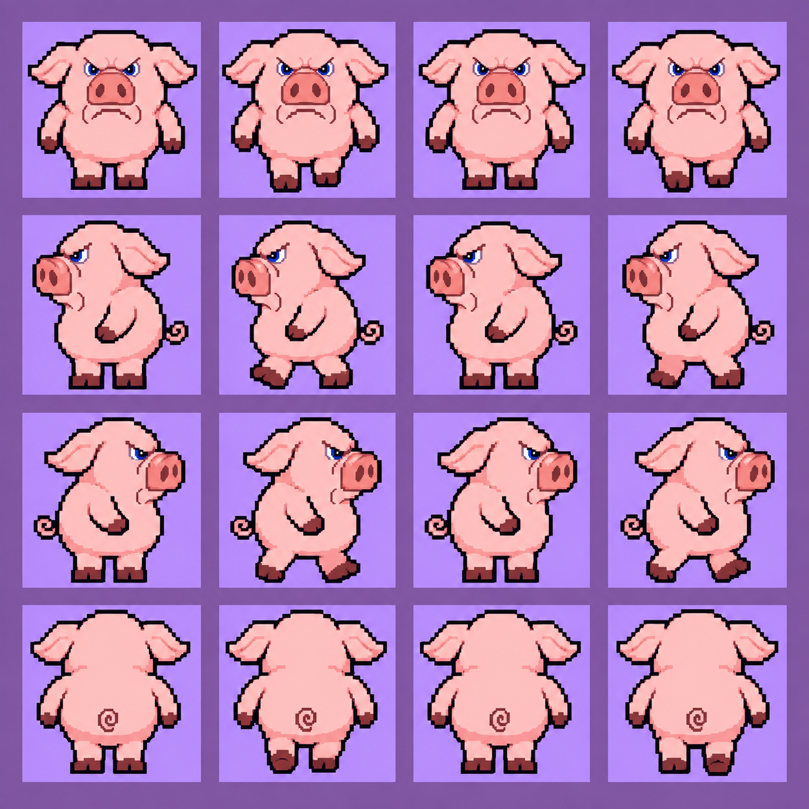
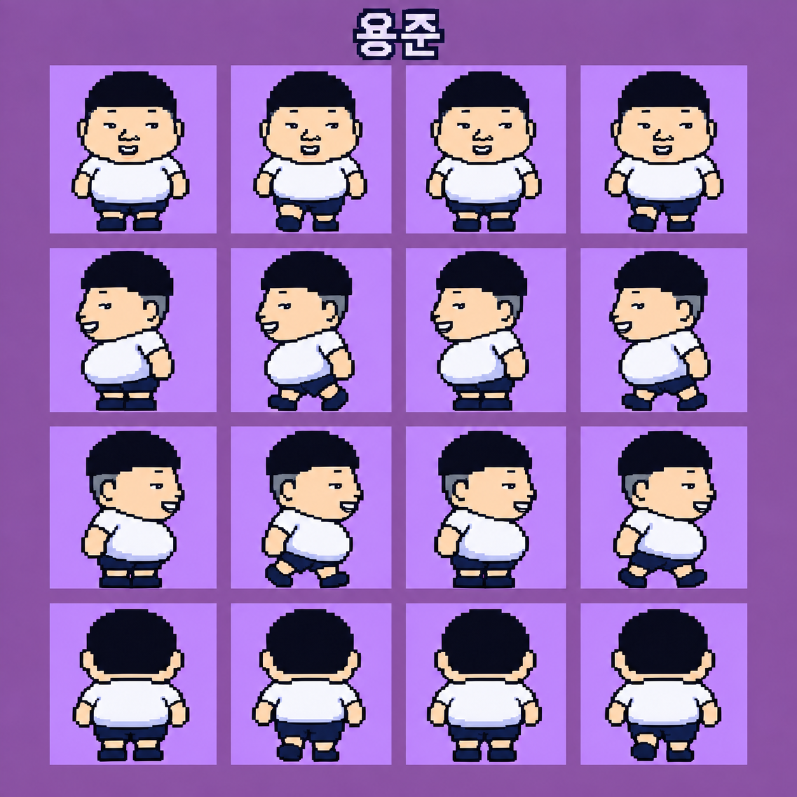

> **적용 완료 (2026-09-11, main)**: 두 engine-sheet 를 `assets/sprites/junhee.png`·`yongjun.png` 로 교체, `characters.js` sideWalk 를 `legFrames` 모드(쥰희 legY 69, 용준 70)로, 컷신 이동의 `driven` 플래그로 NPC 정지 처리가 걷기 프레임을 덮지 않게 수정. 검증: `tests/playtest/teal7.mjs`(이동 중 프레임·정지 0·웃음 복귀 포함 흐름), `side-walk.mjs`, `tests/unit/sprite-order.test.mjs`. 아래는 전달 당시 지침 원문.

# 쥰희 전체 컷신 및 용준 이동·정지 수정 지침

이 PR은 **이미지와 구현 지침만 전달**한다. 실행 코드·기존 게임 PNG·맵·대사·테스트는 변경하지 않았다. 실제 구현은 게임 개발 세션에서 진행한다.

## 이 이미지로 적용하세요

| 캐릭터 | 새 게임용 시트 | 전체 크기 / 셀 | 변경점 |
| --- | --- | --- | --- |
| 쥰희 | [engine-sheet.png](../../assets/source/walk-v4/junhee/engine-sheet.png) | 368×360 / 92×90 | 발을 모은 기본 서기, 걷기 단계 분리 |
| 용준 | [engine-sheet.png](../../assets/source/walk-v4/yongjun/engine-sheet.png) | 272×352 / 68×88 | 더 크고 앞으로 나온 뱃살, 뚱뚱한 체형, 기본 서기 |

두 시트 모두 RGBA 투명, 4열×4행, 엔진 순서 **down/up/left/right**다. 각 행 0번은 정지용 중립 자세, 1번은 발 A, 2번은 중립 복귀, 3번은 발 B다. 생성본의 0·2가 픽셀 단위 동일하다고 가정하지 말고, 고정 중립 반복이 필요하면 0번을 재사용한다. 기존 시트 크기나 다른 캐릭터의 하체 연결 좌표를 그대로 복사하지 않는다.

원본 및 프롬프트는 각 이미지와 같은 폴더의 `walk-sheet.png`, `prompt.txt`다. 원본은 **down/left/right/up** 순서이며 제목·배경을 포함하므로 엔진에 직접 넣지 않는다. 아래 사진은 디자인과 자세 확인용이다.

### 쥰희



### 용준



## 구현할 내용

1. **쥰희가 나오는 인게임 컷신 전체에 적용한다.** 청록숲7만 고치지 말고 아래 기존 등장 경로와 새로 추가된 경로를 검색한다. “전체 수정”은 이동·정지·특수 모션 전환을 일관되게 고치는 뜻이며 대사나 사건을 새로 쓰는 요청이 아니다.
2. 실제 소비 파일 `assets/sprites/junhee.png`, `assets/sprites/yongjun.png`를 위 게임용 시트로 교체한다. 기존 원본은 보존한다. 로더의 2x 규격과 발 기준점을 유지하고, 용준은 머리만 큰 캐릭터가 아니라 배가 나온 뚱뚱한 체형으로 보이게 한다.
3. **이동 중 프레임 초기화 문제를 수정한다.** 조사한 현재 경로에서는 `Game.update`가 컷신 이동을 먼저 갱신한 뒤 `NPC.update`를 호출한다. 이동기가 진행시킨 프레임을 NPC의 대화 중 정지 처리가 다시 0으로 덮어쓴다. 재현에서 두 캐릭터 모두 이동기 뒤 프레임1이 NPC 갱신 뒤0이 되었다. 공통 이동 경로에서 프레임 소유권을 정리하고, 장면별 임시 애니메이션 루프를 복제하지 않는다. 조사 후 새로 변경된 구현이 있으면 최신 코드에 맞춘다.
4. 이동할 때 발이 바뀌고, 멈추면 해당 방향의 **0번 기본 서기**로 돌아오게 한다. 대화·방향 전환·등장·퇴장·평행 이동·달리기에서도 유지한다. 이동 종료 후 일반 NPC 갱신이 다시 동작해야 한다.
5. 쥰희의 기존 `sideWalk` 발 이동 수치는 옛 시트 기준이다. 새 시트에서 하체 연결 높이·발 영역을 측정하고 상체를 고정한 기본→발 A→기본→발 B로 연결한다. 용준도 자신의 셀에서 측정한다. 그림 크기만 맞춘 채 기존 좌표를 적용해 발이 잘리거나 배가 움직이지 않게 한다.
6. 쥰희의 기존 **웃음**은 별도 모션으로 유지한다. 고개를 약간 위로 들고 눈이 안 보이게 호탕하게 웃는 기존 이미지·소리·대사 타이밍을 바꾸지 않는다. 웃음 종료 후 일반 서기, 다음 이동 시 걷기로 복귀하는지 확인한다. 기본 표정을 웃음으로 고정하지 않는다.
7. 용준의 검정 짧은 머리·넓은 볼·가는 눈·치아가 보이는 입·무안경을 유지한다. 형섭의 입 없는 규칙을 적용하지 않는다. 쥰희는 몸과 배 모두 분홍색이다. 다른 캐릭터·목소리·충돌·이벤트 플래그는 보존한다.

## 우선 확인할 등장 경로

- `src/data/cutscenes/void10_maze.js`: 쥰희 이동·퇴장.
- `src/data/cutscenes/void11_tree.js`: 경섭과 대화, 웃음, 접근·물러남, 통나무 쪽 이동·퇴장.
- `src/data/cutscenes/teal7_hide.js`: 쥰희 등장·웃음·숨기·돌아오기·퇴장, 용준 등장·대화·퇴장.
- `src/data/scripts.js`의 `test_junhee`: 테스트룸 서기·웃음·복귀.
- `src/data/character-motions.js`, `src/data/characters.js`, `src/ui/cutscene.js`, `src/world/world.js`: 공통 모션/로더/이동 갱신 경로.
- 최신 브랜치에서 `junhee`와 `쥰희`를 검색해 추가된 장면도 포함한다. 청록숲의 **쥰희 나무동상은 별도 소품**이므로 살아 있는 캐릭터 걷기 이미지로 바꾸지 않는다.

## 구현 완료 시 짧게 확인할 것

두 캐릭터의 실제 컷신 이동에서 연속 프레임이0에 고정되지 않고, 멈추면0으로 돌아오며, 쥰희 웃음 뒤 일반 모션으로 복귀하는지만 집중 확인한다. 새 몸체·발의 잘림도 화면으로 확인한다. 이 전달 PR을 위해 전체 게임 플레이테스트나 다중 리뷰를 반복하지 않는다.

재추출이 필요할 때만 저장소 루트에서 실행한다. 아래 명령은 실제 런타임 PNG를 쓰므로 구현 세션에서 실행한다.

```bash
uv run --with pillow --with numpy -- python tools/sprites/slice_sheet.py --sprites-only assets/source/walk-v4/junhee/walk-sheet.png junhee
uv run --with pillow --with numpy -- python tools/sprites/slice_sheet.py --sprites-only assets/source/walk-v4/yongjun/walk-sheet.png yongjun
```

이번 전달 상태: 내장 이미지 생성으로 두 시트 수정 및 기존 변환기로 추출. 최종 게임 연결과 컷신 전체 반영은 **후속 구현 대상**이다.
