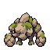
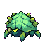
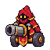

# 돌거북·바위게·대포미니언 스프라이트 사용 안내

이 파일들이 이번에 제작한 적군 스프라이트입니다. 게임을 구현 중인 세션에서는 아래 자산을 사용해 주세요. 이 PR은 이미지 전달만 하며 몬스터 등록, 맵 배치, 전투 로직은 변경하지 않습니다.

기본 경로: `assets/source/krug-scuttle-cannon-v1/`

| 하위 폴더 | 적군 | 전투 대기 |
| --- | --- | --- |
| `krug` | LoL 모티브 돌거북 | 무거운 바위 몸체가 낮아졌다 돌아옴 |
| `scuttle` | LoL 모티브 바위게 | 다리와 등껍질이 조금씩 움직임 |
| `cannon` | LoL 모티브 레드 대포미니언 | 포신과 후드가 살짝 움직임 |

각 적군 폴더에서 다음 파일을 사용하세요.

- `front/front-1.png`: 필드용 정면 1장, 투명 RGBA, 48×48.
- `battle-idle/sheet-transparent.png`: 전투용 왼쪽 대기 4프레임. 128×128 시트, 64×64 셀, 2열×2행.
- 시트 순서는 좌상 → 우상 → 좌하 → 우하. 각 180ms, 총 720ms 반복.
- `battle-idle/idle-1.png` ~ `idle-4.png`: 같은 시트의 개별 프레임.
- `battle-idle/animation.gif`: 동작 미리보기. 게임에서는 PNG를 사용하세요.
- 각 폴더의 `prompt.txt`: 생성 지시 기록. 생성 원본은 이미지 스튜디오에 보존되어 있습니다.

전투 프레임은 셀 내부 `(32, 60)`을 공통 바닥 앵커로 사용하세요. 프레임마다 따로 꽉 채워 리사이즈하지 말고, 스무딩을 끈 정수 배율로 표시하세요. 몬스터별 실제 화면 크기·충돌 판정·밸런스·맵 배치는 구현 세션에서 정합니다. 이 4프레임은 대기용이며 공격·피격·이동 애니메이션이 아닙니다. 대포는 이번 제작에서 레드팀 색상을 선택했습니다.

## 전투 대기 미리보기

돌거북

바위게

대포미니언

