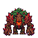
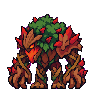
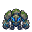
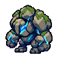

# 정글 레드·블루 스프라이트 사용 안내

레드 브램블백·블루 센티넬 모티브의 신규 적군 이미지입니다. 구현 세션에서 아래 스프라이트를 사용해 주세요. 이 PR은 **이미지와 사용 지침만** 전달하며 게임 등록·맵 배치·전투 패턴은 구현하지 않습니다.

## 파일

기준 폴더는 `assets/source/red-blue-buffs-v1/`입니다. `red/`와 `blue/`에 동일한 구성이 있습니다.

| 용도 | 상대 경로 | 규격 |
| --- | --- | --- |
| 필드 정면 | `<종>/front/front-1.png` | 투명 RGBA 64×64, 정면 1장 |
| 전투 대기 시트 | `<종>/battle-idle/sheet-transparent.png` | 투명 RGBA 192×192, 2열×2행 |
| 전투 개별 프레임 | `<종>/battle-idle/idle-1.png` ~ `idle-4.png` | 투명 RGBA 96×96 |
| 동작 미리보기 | `<종>/battle-idle/animation.gif` | 4프레임 반복, 미리보기용 |

각 폴더의 `prompt.txt`는 생성 프롬프트입니다. 큰 생성 원본과 처리 메타데이터는 이미지 스튜디오의 `output/sprites/red-blue-buffs-v1/`에 보관했습니다. `front/sheet-transparent.png`는 정면 PNG와 같은 1셀 시트입니다.

## 적용 지침

- 전투 모습은 **왼쪽을 향합니다**. 기본 적군 표시에서 다시 좌우 반전하지 마세요.
- 시트 순서는 좌상→우상→좌하→우하입니다. 셀 크기96×96로 분할하고 각220ms, 총880ms로 반복합니다. 기존 2×2 전투 대기 시트 표시 방식을 참고하되 64×64 셀로 잘못 자르지 마세요.
- 필드 정면은 단일 이미지이며 이동 애니메이션 시트가 아닙니다. 공격·피격·사망 모션도 이번 파일에 포함하지 않았습니다.
- 권장 발밑 기준점은 필드 `(32,60)`, 전투 `(48,89)`입니다. 프레임마다 자동 크롭·개별 확대하지 말고 같은 셀·기준점으로 표시하세요. 실제 게임 표시 크기와 충돌 범위는 구현 세션에서 정합니다.
- nearest-neighbor 확대와 스무딩 끄기를 사용하세요. GIF가 아니라 PNG를 게임 자산으로 사용하세요.
- 레드는 수목·붉은 가시·불꽃 핵, 블루는 이끼 낀 바위·푸른 균열 디자인입니다. **기존 레드/블루 미니언 및 청록숲 블루 마나샘과 별개의 몬스터**입니다. 마나샘 자산이나 기존 `blue_buff` 오브젝트를 덮어쓰지 마세요. 신규 적군 ID는 충돌하지 않게 구현 측에서 정하세요.

## 미리보기

### 레드

### 블루

확인 범위: PNG 투명도·크기·시트 분할·4프레임 구분·경계 잘림·프리뷰. 게임 코드 변경이 없으므로 게임 실행·통합 테스트는 수행하지 않았습니다.
