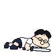
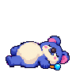
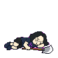

# 형섭·빠맨·경섭 HP0 쓰러짐 이미지

전투에서 HP가 모두 소진되었을 때 아래 스프라이트를 사용해 주세요. **자산과 사용 지침만 전달하는 PR**이며 게임의 HP0 처리·부활·게임오버 로직은 구현 측에서 연결합니다.

| 캐릭터 | 파일 | 특징 |
| --- | --- | --- |
| 형섭 | `assets/source/trio-down-v1/hyungsub/down-1.png` | 짧은 검정 머리·흰 티셔츠·안경·큰 코, 입 없음. 검을 옆에 내려놓고 쓰러짐. |
| 빠맨 | `assets/source/trio-down-v1/ppaman/down-1.png` | 파란 몸·크림 배가 보이도록 쓰러짐. 파란 구슬 한손 마법봉 유지. |
| 경섭 | `assets/source/trio-down-v1/gyeongsub/down-1.png` | 긴 검정 머리·안경·남색 티셔츠·보라 표식. 양손도끼를 옆에 내려놓고 쓰러짐. |

## 사용 규격

- 각각 **투명 RGBA96×96의 정지 이미지1장**입니다. 기존 이동/공격 시트처럼 여러 프레임으로 자르지 마세요.
- 머리는 오른쪽, 발은 왼쪽인 아군 전투불능 자세입니다. 피·상처·사망 효과는 없습니다.
- HP0 상태를 유지할 때 표시하는 최종 자세이며 쓰러지는 과정·부활 애니메이션은 포함하지 않습니다.
- 하단 기준점은 `(48,89)`입니다. 자세와 무기 전체 경계 기준이며, 기존 서 있는 캐릭터의 바닥 좌표에 맞춰 표시 크기를 조정하세요. 기존 전투 시트와 같은 셀 크기/배율이라고 가정하지 마세요. 자세의 실제 픽셀 높이는 형섭39·빠맨44·경섭37입니다.
- nearest-neighbor 확대, 스무딩 끄기를 사용하세요. 기존 걷기·대기·공격 스프라이트는 그대로 보존하고 별도의 전투불능 자산으로 연결하세요.
- 형섭은 **코 아래 입선이 없어야 합니다**. 경섭의 입까지 함께 지우는 규칙은 아닙니다.

## 이미지

형섭

빠맨

경섭

각 폴더의 `prompt.txt`는 내장 이미지 생성 프롬프트입니다. 원본과 처리 메타데이터는 이미지 스튜디오의 `output/sprites/trio-down-v1/`에 보관했습니다. 원본 캐릭터와 기존 전투 외형을 참조해 생성했으며, 투명화 후 nearest-neighbor로 축소했습니다.

확인 범위는 이미지3종의 규격·투명도·잘림·육안 확인입니다. 게임 실행/HP0 상태 연결은 이 자산 전달 PR에서 검증하지 않았습니다.
